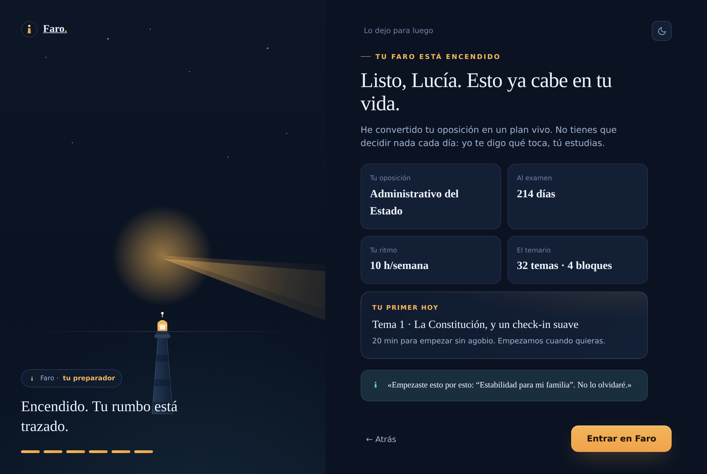
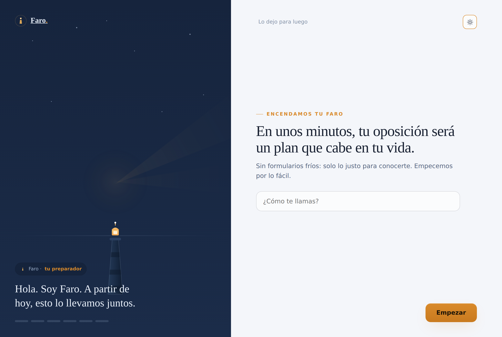

# Prototipo · Onboarding ("Encender el faro")

> El primer momento de la verdad: en unos minutos convierte el caos en un plan. El embudo de la home aterriza aquí — donde nace la hiperpersonalización.

**Abre [`index.html`](index.html).** Autocontenido, mismo Sistema de Diseño (Doc 08).

| Modo oscuro | Modo claro |
|---|---|
|  |  |

## El flujo (Doc 10 §2 · F-ON-1…7)

Un asistente paso a paso, no un formulario frío. A la izquierda, **el faro se va encendiendo** a cada paso (la metáfora hecha interacción); a la derecha, las preguntas, con la voz de Faro acompañando.

0. **Bienvenida** — «Encendamos tu faro» + tu nombre.
1. **Tu oposición** (F-ON-1) — eliges cuerpo; Faro carga temario y estructura.
2. **Tu tiempo real** (F-ON-2) — patrones (noches / finde / un poco cada día / días enteros) + horas/semana.
3. **Tu fecha** (F-ON-3) — conoces la fecha o Faro la estima.
4. **Tu punto de partida** (F-ON-4) — de cero / ya llevo algo / avanzado.
5. **Tu porqué** (F-ON-5) — con tus palabras; el oro del acompañamiento.
6. **Cómo te cuido** (F-ON-7) — intensidad del acompañamiento.
7. **Tu plan, al instante** (F-ON-6) — animación de generación → resumen del plan (oposición, días al examen, ritmo, temario) + **tu primer Hoy** + la voz de Faro, recordando tu porqué.

Sale del onboarding **con dirección y calma**, no con un formulario más, y entra en la app.

## Detalles de conversión
Validación ligera (no avanzas sin lo esencial), opción de «lo dejo para luego», progreso visible, y el faro encendiéndose como recompensa emocional. Los CTA «Empieza gratis» de la home llevan aquí; al terminar, entra en *Mi Travesía*.

## Interacción
Tema claro/oscuro · navegación con validación · selección de oposición / patrón de horas (slider) / fecha / punto de partida / intensidad · captura del porqué · generación animada del plan con tus datos reales · `prefers-reduced-motion` respetado.
