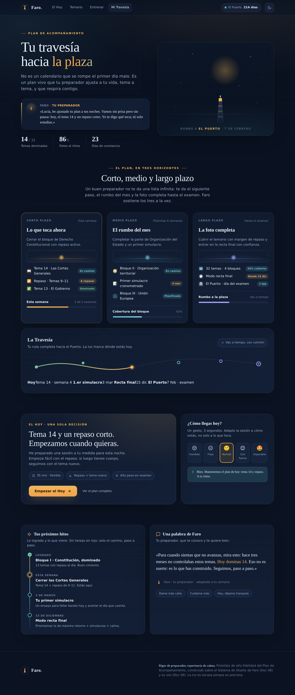
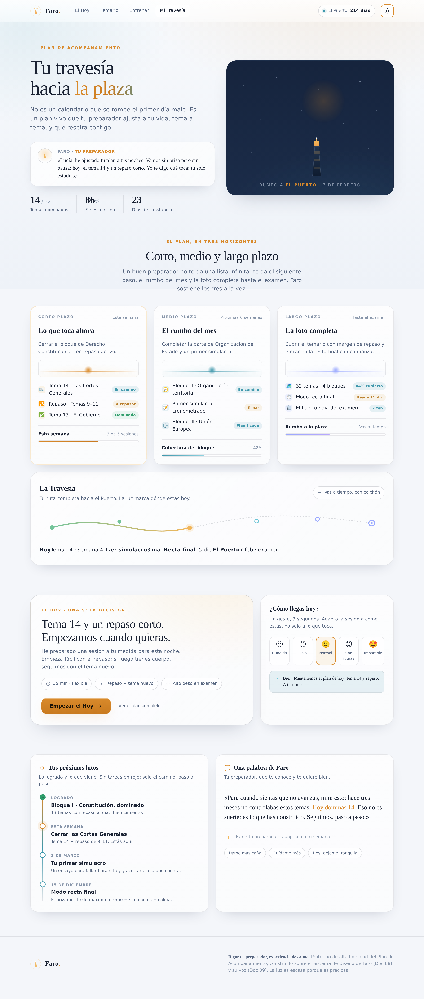

# Prototipo · Plan de Acompañamiento

> Rediseño de alta fidelidad de la pantalla **Plan de Acompañamiento** (Mi Travesía) de Faro.
> Un preparador que te conoce y te planifica el estudio a **corto, medio y largo plazo**.

**Abre [`index.html`](index.html) en cualquier navegador.** Es autocontenido (sin build, sin dependencias) — solo carga las fuentes desde Google Fonts.

| Modo oscuro (por defecto) | Modo claro |
|---|---|
|  |  |

---

## Qué es esto

Un prototipo navegable que materializa la promesa de Faro —*"rigor de preparador, experiencia de calma"*— en la pantalla donde vive el plan de estudio. No es un mockup estático: tiene tema claro/oscuro, check-in emocional interactivo, animaciones que respiran y diseño responsive.

El concepto central, según el encargo: **el preparador no te da una lista infinita, te sostiene tres horizontes a la vez** — el siguiente paso (corto), el rumbo del mes (medio) y la foto completa hasta el examen (largo).

## Anatomía de la pantalla

1. **Hero "El rumbo"** — Titular editorial + un **mensaje personalizado del preparador** (la presencia de Faro, Doc 09) y la escena del faro con su haz de luz pulsante hacia *El Puerto* (la plaza).
2. **Los tres horizontes** — El corazón del rediseño. Tres tarjetas (corto / medio / largo plazo), cada una con su línea de horizonte, sus ítems con estado de dominio sutil (*En camino · A repasar · Dominado*) y su progreso sereno. La luz es más cercana en "corto" y más lejana en "largo".
3. **La Travesía** — La ruta completa Hoy → simulacro → recta final → Puerto, como un camino que avanza hacia el horizonte (Doc 08 §7, "Mapa de la Travesía").
4. **El Hoy** — Una sola decisión, una sola acción primaria (el botón "de la luz"), con la sesión flexible del día (Doc 06 §5.2).
5. **Check-in emocional** — "¿Cómo llegas hoy?": un gesto que adapta la sesión y responde con la voz de Faro (Doc 05 §4). **Interactivo.**
6. **Hitos + Una palabra de Faro** — Línea de tiempo sin culpa (cero rojo de tareas vencidas) y el panel de acompañamiento con control de intensidad (Doc 05 §3.3).

## Cómo respeta el Sistema de Diseño (Doc 08)

| Principio del Doc 08 | Cómo se aplica aquí |
|---|---|
| **Noche serena** (lienzo azul noche, no negro) | Fondo `#0B1322`/`#131F35`, modo oscuro como experiencia central |
| **La luz** (acento cálido y escaso) | Ámbar `#F2B65A` reservado a "lo siguiente", logros y *una sola* acción primaria por pantalla |
| **Nunca rojo de alarma** | Lo pendiente/a repasar usa ámbar templado y teal sereno; la línea de hitos no acumula culpa visual |
| **Calidez profesional** | Tipografía editorial (Fraunces serif + Inter), nada infantil ni estridente |
| **El pulso del faro** | Micro-animaciones que respiran (haz, glow, nodo "Hoy"), nunca nerviosas |
| **Espacio que respira** | Escala 4/8, márgenes generosos, "una pantalla, una intención" |
| **Accesibilidad** | Contraste AA, navegable por teclado, estados no solo por color, **`prefers-reduced-motion` respetado** |
| **Móvil-first responsive** | Las columnas colapsan con elegancia; la escena pasa arriba en móvil |

La voz de los textos sigue el Doc 09: tú cercano, verbos de avance, validar antes de dirigir, **cero culpa**, breve.

## Stack

HTML + CSS + un toque de JS vainilla, sin frameworks, para que sea fácil de revisar y portar. La dirección técnica del producto (Doc 12) recomienda React/Next.js con design tokens; **las variables CSS de este prototipo (`:root`) son directamente esos tokens** y pueden migrarse tal cual a la librería de componentes.

## Regenerar las capturas

```bash
# requiere el Chromium preinstalado del entorno
node scripts/shot.mjs   # (script de ejemplo; ver historial del PR)
```
