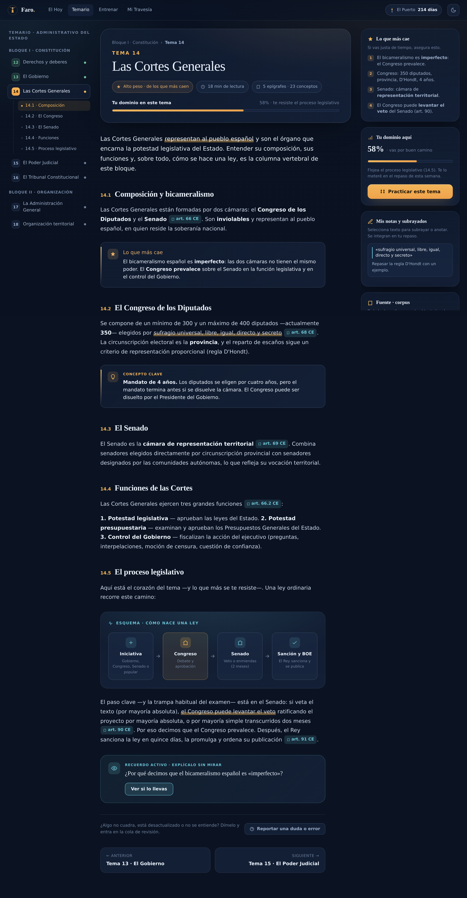
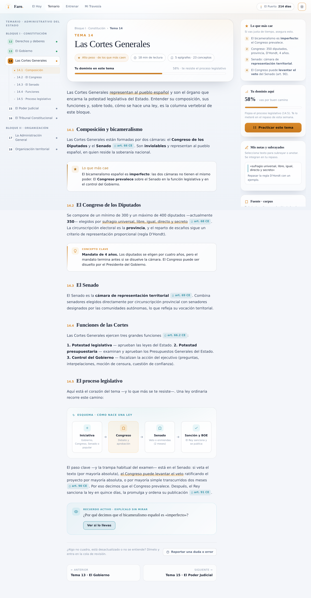

# Prototipo · Temario (lectura de un tema)

> Rediseño de alta fidelidad de la vista **Temario** de Faro, con un tema abierto y **todo lo que pasa dentro**: lectura serena, esquemas, subrayados, notas, enlace a la fuente (corpus) y autoexplicación.

**Abre [`index.html`](index.html) en cualquier navegador.** Autocontenido, sin build. Comparte los tokens del Sistema de Diseño (Doc 08) con el Plan de Acompañamiento.

| Modo oscuro | Modo claro |
|---|---|
|  |  |

## Anatomía (Doc 07 + Doc 10 §4)

Tres columnas en escritorio (índice · lectura · utilidades); se apilan en tablet/móvil.

**Índice (izq.)** — Navegación tema → epígrafe con **estado de dominio** sutil (verde/ámbar/gris). El tema actual se despliega en sus epígrafes con *scroll-spy* (F-TEM-1).

**Lectura (centro)** — El corazón:
- **Cabecera del tema** con "de los que más caen", tiempo de lectura, nº de conceptos y tu **dominio** (F-TEM-3).
- **Prosa cómoda** (medida ~70ch, interlineado 1.75) pensada para horas de lectura (F-TEM-2).
- **Subrayados** interactivos: selecciona texto y aparece una **barra flotante** (Subrayar · Nota · Preguntar a Faro). Lo subrayado/anotado se guarda en el rail y "se integra al repaso" (F-TEM-5).
- **Enlaces a la fuente** (`art. 66 CE`…): cada afirmación es **trazable al corpus** (F-TEM-6, Doc 07 §3).
- **Callouts**: *Concepto clave* y *Lo que más cae* (ámbar templado, nunca rojo).
- **Esquema visual**: "cómo nace una ley" como un flujo de nodos (Iniciativa → Congreso → Senado → Sanción/BOE).
- **Recuerdo activo**: "Explícalo sin mirar" — pregunta, revelar respuesta y autoevaluación que alimenta el repaso (F-TEM-4, Doc 06 §2).
- **Reportar duda/error** → cola de revisión, con la voz de Faro (F-TEM-7, Doc 07 §6).
- Navegación a tema anterior/siguiente.

**Utilidades (der.)** — *Lo que más cae*, *Tu dominio aquí* + **Practicar este tema**, *Mis notas y subrayados* (se rellena al subrayar) y *Fuente · corpus* (trazabilidad).

## Interacciones (vanilla JS)
Tema claro/oscuro · barra de progreso de lectura · scroll-spy del índice · subrayar/anotar por selección · revelar autoexplicación + autoevaluar · enlaces a la fuente · reportar duda · practicar. Todo con la voz de Faro (Doc 09) y `prefers-reduced-motion` respetado.

## Fidelidad al Sistema de Diseño
Noche serena, "la luz" como acento escaso, **cero rojo de alarma** (lo pendiente y los avisos en ámbar templado/teal), tipografía editorial, iconografía lineal, mini faro en la cabecera, responsive y modo claro/oscuro.
